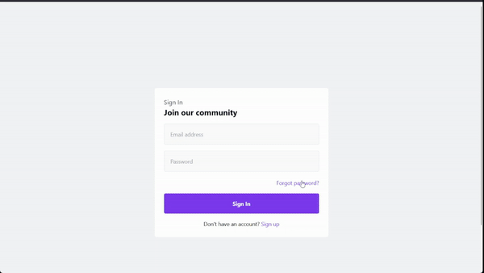

# TIL

TIL (Today I Learned) is a simple app that allows users to create posts, updated profiles and follow other users.
It is built using Django and Django CBV (Class Based Views).

## Technologies

1. Python 3.x
2. Django
3. Sqlite
4. Allauth
5. Tailwind CSS
6. Sorl-thumbnail
7. Class Based Views

## Demo



## Installation

1. Clone the repository

   ```bash
   git clone https://github.com/asmaahamid02/til-django-cbv.git
   ```

2. Create virtual environment (optional)

   ```bash
   python -m venv venv
   #or
   pip install pipenv
   pipenv shell
   ```

3. Enter virtual environment (optional)

   ```bash
    source venv/bin/activate #for linux
    venv\Scripts\activate #for windows
    #or
    pipenv shell
   ```

4. Install dependencies

   ```bash
   pip install -r requirements.txt
   ```

5. Create a database in Sqlite

   ```bash
    python manage.py migrate
   ```

6. Create a superuser

   ```bash
    python manage.py createsuperuser
   ```

7. Run the server

   ```bash
    python manage.py runserver
   ```
